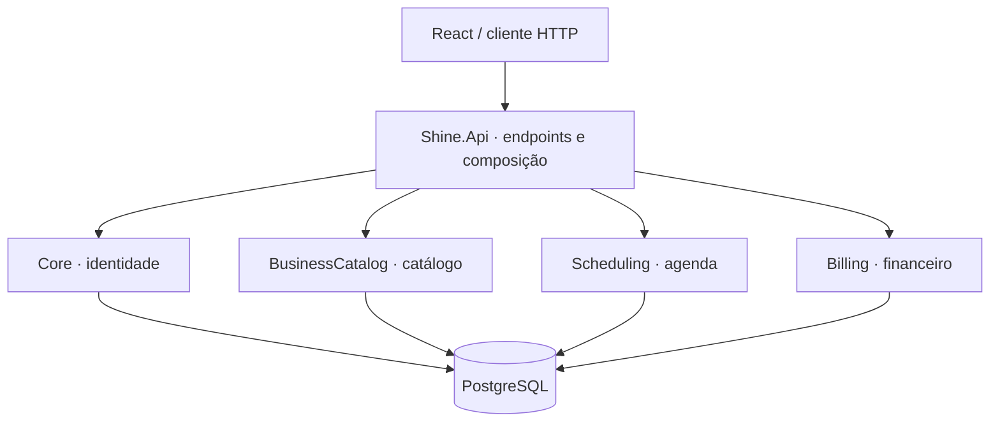

# Shine · Backend

API de uma plataforma de gestão de serviços com **ASP.NET Core, .NET 10 e PostgreSQL**. Um monólito modular que reúne identidade, catálogo de serviços, agendamento e faturamento.

> **Projeto de portfólio.** A iniciativa comercial foi encerrada. O projeto preserva a implementação e as decisões técnicas, sem oferta comercial, SLA ou compromisso de manutenção para produção.

[Frontend](https://github.com/Shine-Solucoes-Tecnologicas/Shine-Frontend) · [Arquitetura](docs/architecture.md) · [Contribuição](CONTRIBUTING.md)

## Destaques técnicos

| Área | Implementação |
| --- | --- |
| Organização | Domain, Application e Infrastructure por módulo; limites verificados por testes |
| Identidade | Autenticação, autorização, recuperação de senha |
| Múltiplas unidades | Seleção de tenant e escopos de acesso explícitos |
| Agenda | Disponibilidade, capacidade, agendamentos e lembretes |
| Catálogo | Serviços, profissionais e recursos do negócio |
| Financeiro | Contratos, assinaturas, registros financeiros e webhooks |
| Persistência | Entity Framework Core, migrations e PostgreSQL |
| Qualidade | Testes unitários, de integração e de arquitetura; CI e verificações de segurança |

Esses destaques descrevem código presente, não uma certificação de prontidão para produção. O frontend ainda não expõe todos os módulos. Entregas de e-mail em desenvolvimento usam simulação; integrações externas dependem de configuração.

## Arquitetura



Cada módulo mantém regras e testes próprios. Integrações usam contratos, eventos ou portas explícitas; módulos não referenciam outros módulos diretamente. Veja as [regras de dependência](docs/architecture.md) e as [decisões de persistência](docs/persistence.md).

## Executar localmente

Pré-requisitos: SDK **.NET 10.0.400** (ou patch compatível com `global.json`) e Docker com Compose.

Na raiz deste repositório, em PowerShell:

```powershell
docker compose up -d
dotnet tool restore
dotnet restore Shine.Backend.slnx
$env:ConnectionStrings__ShineDb = 'Host=localhost;Port=5433;Database=shine;Username=shine;Password=shine'
dotnet ef database update --project platform/Core/src/Shine.Infrastructure --startup-project host/Shine.Api
dotnet run --project host/Shine.Api --launch-profile http
```

A API atende em `http://localhost:5098`; verifique `GET /health`. Os valores acima são exclusivos do ambiente local. As configurações de desenvolvimento incluem chaves ilustrativas e entregas simuladas; use segredos próprios fora desse ambiente.

Para encerrar os serviços sem apagar os dados: `docker compose stop`.

## Validar

```powershell
dotnet build Shine.Backend.slnx --configuration Release
dotnet test Shine.Backend.slnx --configuration Release --no-build
```

Os testes de integração exigem PostgreSQL e configuração da conexão. Consulte o [isolamento dos bancos de teste](docs/testing/integration-database-isolation.md). Nunca aponte testes para um banco de produção.

## Explore o código

```text
host/Shine.Api/            Endpoints, autenticação e composição HTTP
platform/Core/            Identidade, autorização e capacidades centrais
platform/Shared/          Tipos mínimos compartilhados
modules/BusinessCatalog/  Catálogo de serviços e profissionais
modules/Scheduling/       Agenda e disponibilidade
modules/Billing/          Contratos e financeiro
tests/                    TestKit e testes de arquitetura
docs/                     Contratos, decisões e operação
```

## Documentação

- [Autorização administrativa](docs/administrative-authorization.md)
- [Configuração](docs/configuration.md)
- [Entitlements e limites](docs/entitlements.md)


- [Implantação e segurança](docs/deployment-security.md) e [CI](docs/security-ci.md)

## Uso do código

Disponibilizado para apresentação e consulta. Nenhuma licença de código aberto foi concedida; consulte [NOTICE.md](NOTICE.md). Para relatar vulnerabilidades, veja [SECURITY.md](SECURITY.md).
